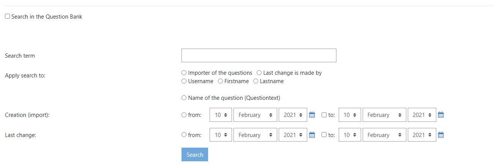

# Question Finder Plugin

## moodle local questionfinder
Moodle Local Questionfinder is an extended version of the Question search module for Moodle - Copyright (C) 2014 Ray Morris, this new module adds several search options to the original functionality extended by Tobias Kutzner (Moodle Moot DACH 2019: Improve questionbank with better search options for question Tobias Kutzner, Katja Neubehler, Gerhard Schwed), Pedro Rojas Copyright (C) 2020
## Description (Original question search module for Moodle - Copyright (C) 2014 Ray Morris):
Adds text search to the question bank. You can find questions and answers which contain specific words and phrases. Some have used it to find "all of the above" answers by searching for that phrase.  

The wildcard % can be used within a search. For example, chocolate%recipe will find:

chocolate cake recipe

chocolate pie recipe

chocolate and peanut butter bar recipe

## Changelog:
Version (3.1.0) adds several search options to the original functionality (Extended by Tobias Kutzner (Moodle Moot DACH 2019: Improve questionbank with better search options for question Tobias Kutzner, Katja Neubehler, Gerhard Schwed), Pedro Rojas, Eleonora Kostova):

- Search by **Importer** (username, firstname, lastname)
- Search by **Last Modified by** (username, firstname, lastname)
- Search by **Question Text** (title)
- Search by **Creation Date** (single date or range)
- Search by **Modification Date** (single date or range)

## How to Use:
Navigate to the Question Bank search tab **Site Home > Actions Menu > More... > Questions** on your Moodle server and choose a search mode:

### Search by Author, Question Text or Last Modified by:
1) Click on the respective checkbox **Search in the Question Bank**
2) Write the text you want to find in the "Search by" text input
3) Click on the respective radio button depending on the type of search (**Importer**, **Question text** or **Last modified by**)
4) When choosing **Importer** or **Last modified by** you need to choose the respective radio button depending on the type of name you want to pick (*username*, *firstname*, *lastname*)

### Search by Creation Date or Modification Date:
1) Click on the respective checkbox **Search in the Question Bank**
2) Select the desired type of search date by clicking on the radio button "**from:**"  for a single (*creation* or *modification*) date search
3) Click on the checkbox "**to:**" pick the starting and the finishing date for a ranged search on either **Creation (Import):** or **Last Changed:**

## Developer Documentation:
The plugin uses the existent core_question/bank/search/condition moodle functionality.
### UI:
The plugin elements are created by making use of the **html_writer** and **MoodleQuickForm** creating several inputs:
- 1 Texbox
- 3 Checkboxes
- 8 Radio Buttons
- 4 Calendars
### SQL Queries:
The plugin uses the default SQL Moodle database by adding extra conditions to the existant search queries. The queries are spread in three functions **init()**, **initdate()** and **initdaterange()**. The first adds the conditions for **question text** (question title or description), **author** and **last modifier**; the second adds conditions for **single date** **creation date** and **modification date** and the last adds conditions for **a range** of **creation dates** and **modification dates**.
 
 
## Moodle plugin link:
[https://github.com/eLearnTK/moodle_local_questionfinder](https://moodle.org/plugins/moodle_local_questionfinder)

Maintaned by: **Tobias Kutzner, Ray Morris** 

Updated by: **Tobias Kutzner, Pedro Rojas, Eleonora Kostova**
